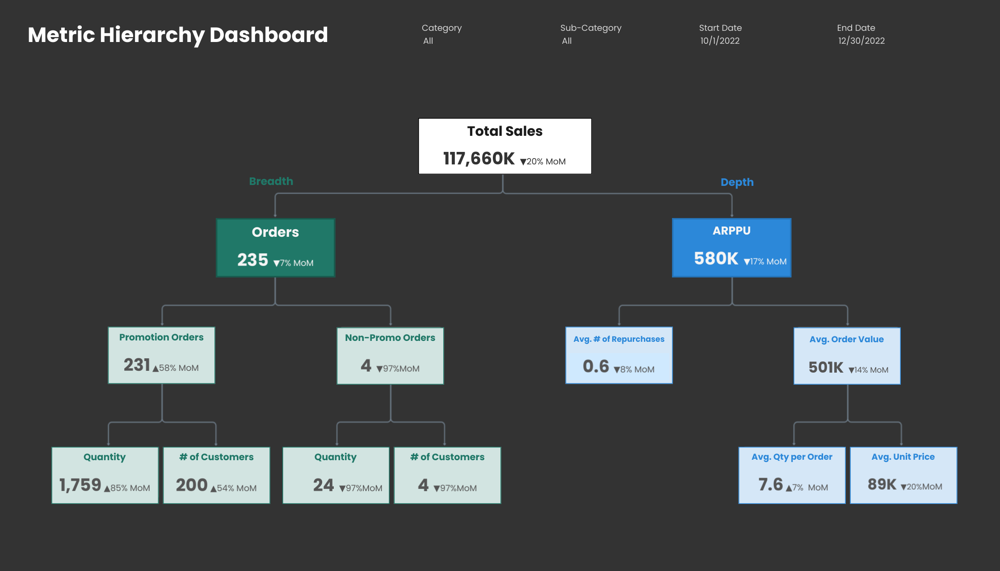

# Overview
This dashboard uses a metric hierarchy framework to break down month-over-month (MoM) changes in total sales into breadth (order and customer volume) and depth (value per purchasing customer).
Rather than treating sales as a single outcome, the dashboard clarifies which underlying metrics actually drove MoM changes, and how those drivers differ across product categories.
 
The analysis covers the period from October 1, 2022 to November 30, 2022.

# Business Question
- When total sales change MoM, are those changes driven more by an increase in orders and customers, or by higher spending per customer and per order?
- How do these mechanisms vary across product categories?

# Dashboard
- **Tableau Public:** [View Metric Hierarchy Dashboard](https://public.tableau.com/app/profile/jungwon.hur/viz/Part10-2_MetricHierarhcy/MetricHierarchyDashboard)
- **Core structure:** Sales decomposed into Breadth (Orders, Customers, Quantity) and Depth (ARPPU, AOV, Repurchase behavior)
- **Key filters:**
    * Date range (MoM comparison)
    * Product category (All, Furniture, Office Supplies, Technology)
    * Sub-category

# Key Insights
**Overview**
- Total sales increased sharply MoM, driven by a substantial rise in orders and customers, while depth metrics such as ARPPU and AOV showed comparatively smaller or mixed changes, indicating that revenue growth was led by expanded purchasing activity rather than higher spend per customer.

**By Category**
- **Furniture:** sales growth was supported by increases in both order volume and per-customer value, indicating that demand expanded without compromising monetization quality. However, ARPPU and AOV demonstrated relatively smaller rises compared to volume metrics, suggesting that the near-term focus should be maintaining the AOV/ARPPU lift.
- **Office Supplies:** sales growth was primarily from breadth expansion, showing consistent increases across both promotional and non-promotional purchases. However, depth weakened as ARPPU and AOV declined, indicating that future gains may require shifting focus from volume expansion toward improving per-order and per-customer value.
- **Technology:** sales growth was mainly driven by increased order activity, particularly from non-promotional purchases, while basket-level value weakened despite gains in unit pricing. This indicates that increased transaction frequency did not fully translate into deeper per-order spending, highlighting a need to reinforce value per purchase.

# Business Implications
- Categories where volume and value metrics diverge sharply (Office Supplies, Technology) may benefit from category-specific strategies rather than uniform growth tactics.
- Balanced improvements across both dimensions, as seen in Furniture, indicate healthier demand dynamics and more resilient revenue drivers, supporting continued investment in demand expansion while maintaining value-focused levers such as pricing discipline and basket composition.
